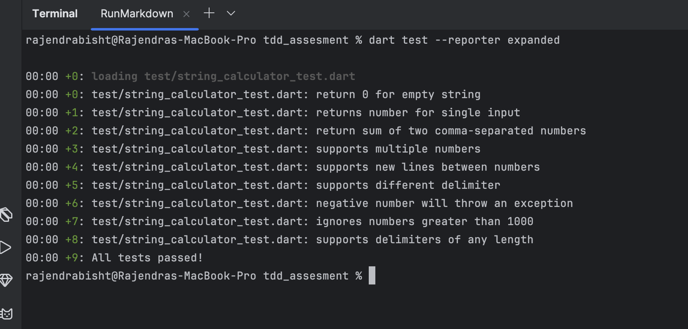

# String Calculator (TDD)

This project is an implementation of the **String Calculator kata** using **Test-Driven Development (TDD)** in Dart.

---

## Problem Summary

The `StringCalculator` supports the following requirements:

1. **Basic Calculator Method**  
   Create a simple String Calculator with the method signature:  
   `int add(String numbers)`
    - Returns the sum of numbers in the input string
    - Empty string (`""`) returns `0`
    - Supports single (`"1"`) and two numbers (`"1,2"`)

2. **Unknown Amount of Numbers**  
   The `add` method can handle an unknown number of values separated by delimiters.

3. **Newline as a Delimiter**  
   Newlines (`\n`) are allowed as delimiters in addition to commas.  
   Example:
    - `"1\n2,3"` → `6`

4. **Custom Delimiters**  
   Custom delimiters are supported using the format:  
   `//[delimiter]\n[numbers…]`  
   Example:
    - `"//;\n1;2"` → `3`  
      The delimiter declaration is optional, and default delimiters remain supported.

5. **Negative Number Validation**  
   Calling `add` with negative numbers throws an exception with the message:  
   `"negative numbers not allowed"`  
   If multiple negative numbers are present, all are listed in the exception message.

6. **Ignore Large Numbers**  
   Numbers greater than `1000` are ignored.  
   Example:
    - `"2,1001"` → `2`

7. **Delimiters of Any Length**  
   Delimiters of any length are supported when defined in brackets.  
   Example:
    - `"//[***]\n1***2***3"` → `6`

---

## Implementation Approach

- Implemented using a `StringCalculator` class as required
- Logic kept minimal and test-driven

This approach strictly follows **TDD principles** and keeps the code readable and maintainable.

---

## Why TDD?

Test-Driven Development helps you:

- Write **only the code that is needed**
- Catch edge cases early
- Refactor safely with confidence
- Build self-documenting APIs
- Avoid over-engineering

> In this project, **every feature begins with a failing test** before implementation.

---

## ✨ Features Implemented

| # | Feature                        | Example Input          | Output      |
|---|--------------------------------|------------------------|-------------|
| 1 | Empty string returns zero      | `""`                   | `0`         |
| 2 | Single number                  | `"1"`                  | `1`         |
| 3 | Two numbers                    | `"1,2"`                | `3`         |
| 4 | Unknown amount of numbers      | `"1,2,3,4"`            | `10`        |
| 5 | Newline delimiter              | `"1\n2,3"`             | `6`         |
| 6 | Custom delimiter               | `"//;\n1;2"`           | `3`         |
| 7 | Multiple negatives throw error | `"1,-2,-3"`            | ❌ Exception |
| 8 | Ignore numbers > 1000          | `"2,1001"`             | `2`         |
| 9 | Delimiter of any length        | `"//[***]\n1***2***3"` | `6`         |

---

## Usage Examples


final calculator = StringCalculator();

calculator.add("");                  // 0
calculator.add("1");                 // 1
calculator.add("1,2");               // 3
calculator.add("1\n2,3");            // 6
calculator.add("//[***]\n1***2***3");// 6

---

## Project Structure

- lib/
   └─ string_calculator.dart
- test/
    └─ string_calculator_test.dart

---

## 🧪 TDD Commit Strategy

This project follows the Red–Green–Refactor cycle:

- **RED**: Each feature starts with a failing test (`test: add ...`)
- **GREEN**: The minimal implementation is added next (`feat: ...`)
- **REFACTOR**: Cleanup commits improve structure without changing behavior

While commits are labeled using conventional `test:` and `feat:` prefixes, each test commit precedes its corresponding implementation commit, demonstrating strict test-first development.

---

## Test Result



---

## Author

- Rajendra Bisht
- Senior Flutter / Dart Engineer

- Clean Architecture
- TDD & SOLID

🔗 GitHub: https://github.com/rbishtdev

🔗 LinkedIn: https://www.linkedin.com/in/r-bisht/

## Running Tests

Run the tests using:

```bash
dart test


